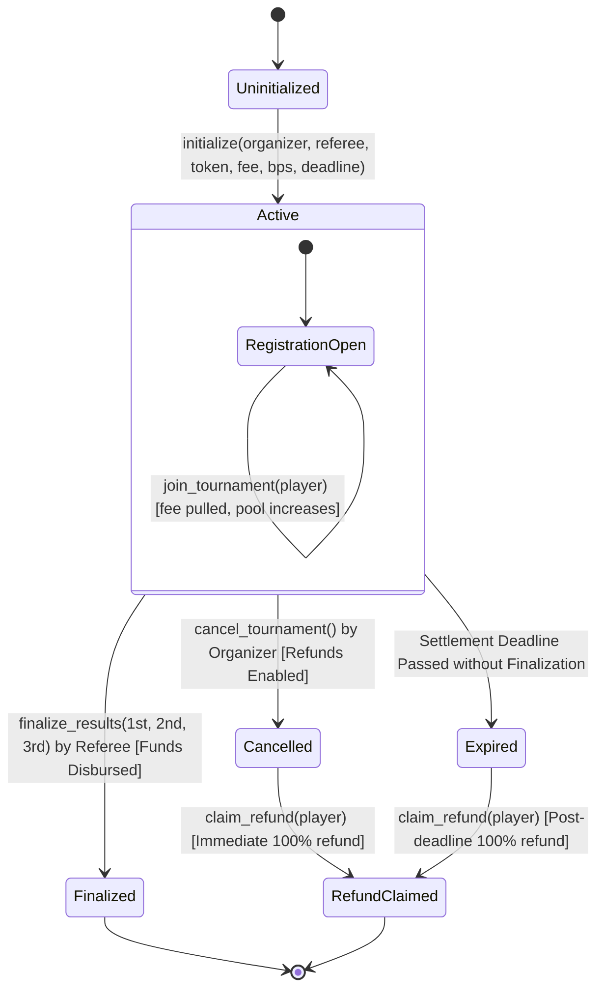

# GGG (Good Game Guild) — MVP QA Context & Specification

> **Project:** GGG (Good Game Guild)  
> **Ecosystem:** Stellar Blockchain & Soroban Smart Contracts  
> **Live Deployment:** [https://ggg.quest](https://ggg.quest)  
> **Repository:** [webnxt-2030/ggg](https://github.com/webnxt-2030/ggg) (Branch: `main` / `staging` / `develop`)  
> **Network:** Stellar Testnet (Default), Mainnet (Public ready)  
> **Contract Hash:** `9319ccbb7148750882df1cf735162059afe017778c9af37984304f291d5fe702`

---

## 1. Executive Summary & Core Value Proposition

GGG is a trustless, decentralized tournament prize-escrow and match-settlement protocol built on the Stellar network using Soroban smart contracts.

### The Problem

Traditional esports and grassroots gaming tournaments require a centralized custodian (organizer, Discord mod, or third-party platform) to collect entry fees and hold the prize pot until payouts occur. This introduces single points of failure:

- Custodians can skim funds, delay payouts, or rug-pull the prize pool.
- Players must trust unverified third parties.
- High fees or lack of accessible escrow for community gaming brackets.

### The GGG Solution

GGG replaces the custodian entirely with a dedicated on-chain Soroban escrow contract per tournament:

1. **Self-Custody & Neutrality:** The smart contract is the middleman holding the pot. There is no platform withdrawal or admin back-door to drain funds.
2. **Dynamic Prize Pool:** The prize pot scales dynamically as players pay entry fees directly from their own non-custodial wallets (Freighter).
3. **Automated On-Chain Settlement:** A neutral referee submits certified standings, triggering a single on-chain transaction that disburses winnings according to preset percentages.
4. **Guaranteed Refunds:** If the tournament is cancelled or reaches its settlement deadline without resolution, players can claim 100% of their entry fees directly from the contract.

---

## 2. Participant Roles & Permissions

| Role               | Wallet / Auth Requirement                     | Responsibilities & Actions                                                                                                                                                                               | Permissions & Contract Guards                                                                                                                                                                                                 |
| :----------------- | :-------------------------------------------- | :------------------------------------------------------------------------------------------------------------------------------------------------------------------------------------------------------- | :---------------------------------------------------------------------------------------------------------------------------------------------------------------------------------------------------------------------------- |
| **Organizer**      | Freighter Wallet (`organizer.require_auth()`) | Creates tournament, defines metadata (game title, banner, rules), configures financial parameters (token, entry fee, settlement deadline, winner percentage splits), deploys & initializes the contract. | • Must not be the same address as the referee (`organizer != referee`).<br>• Can call `cancel_tournament()` before deadline to enable immediate player refunds.<br>• Cannot withdraw or skim player funds.                    |
| **Referee**        | Freighter Wallet (`referee.require_auth()`)   | Acts as the impartial tournament official who verifies match outcomes and certifies the final leaderboard.                                                                                               | • Sole address authorized to call `finalize_results(first, second, third)`.<br>• Must pick distinct, registered players (`WinnersNotDistinct`, `WinnerNotRegistered`).<br>• Can only finalize before the settlement deadline. |
| **Player**         | Freighter Wallet (`player.require_auth()`)    | Discovers tournaments (web UI or QR code), connects wallet, joins by paying the entry fee.                                                                                                               | • Calls `join_tournament(player)` transferring entry fee via SAC.<br>• Can call `claim_refund(player)` permissionlessly if cancelled or if deadline expired.<br>• Max cap enforced (`MAX_PLAYERS = 100`).                     |
| **Platform Admin** | Web Session (Role: `ADMIN`)                   | System-wide governance, dispute escalation, tournament monitoring.                                                                                                                                       | • Outranks `ORGANIZER` in the web application.<br>• Administrative controls are enforced at the web/API layer; contract funds remain strictly locked under contract logic.                                                    |

### 2.1 Standard QA Testnet Wallets & Rules

> [!IMPORTANT]
> **Network:** Stellar Testnet ONLY.  
> **Universal Fee Directive for Testing:** **ALL fees must be strictly 1 XLM ONLY** (`10,000,000 stroops`) to all users across all tournament setups, player registrations, and test executions. This is strictly for testing purposes on Testnet.

The dedicated Freighter Testnet wallets configured for end-to-end testing, role authorization, and contract verification:

| Role / Entity | Name | Stellar Testnet Public Address | Primary QA Scope |
| :--- | :--- | :--- | :--- |
| **Organizer** | `Organizer1` | `GCND3TIWXXU6R7OE7DEVPKOC4AUAPVFRXQTV6E7MIWEMMNWI6PHY4QXQ` | Tournament creator, contract deployment & initialization, cancellation tests. |
| **Organizer** | `Organizer2` | `GBHGBR2HXMTI73DZZTI53GDK7F5CXKBWX34TTLEOG5C2BGDJTA5YE2RK` | Secondary organizer for multi-organizer isolation & authorization testing. |
| **Player** | `Player1` | `GCVNHZ5ETC62BVHJZWDYNRZ5Q5WLWQ3FXXNYF7MNBNW7Q2RIBCBPVO6K` | Player registration (1 XLM), refund claims, 1st place podium winner. |
| **Player** | `Player2` | `GBLLV6KZ2VOTVG6GCENHQ5FD7SGOVCK6NMO7GFKKJGYSE2M75C56QC44` | Player registration (1 XLM), dynamic prize pool scaling, 2nd place winner. |
| **Player** | `Player3` | `GBE737HOTAV3RGAXKEZUE5ZLXOLE4O5EWDLZ24FYU4RS24P5F3RMYQQH` | Player registration (1 XLM), multi-participant refund tests, 3rd place winner. |
| **Referee** | `referee1` | `GAOOTDMZH4IOEO5PBII5PBYZWWNNQ2LYNDHFX2DBVZWYWBGGCSIOFZCF` | Impartial tournament referee, match verification, `finalize_results()` signing. |
| **Referee** | `referee2` | `GDDINMRDLF4RNGRPA5OEG7W4KJ5J4V2GVVDNWMBYFEFBWFPL7QGAPXUY` | Secondary referee for unauthorized settlement checks (`TC-REF-003`) & role collision tests. |

---

## 3. Financial Mechanics & Math Model

### 3.1 Currency & Asset Standard

- Utilizes the **Stellar Asset Contract (SAC)** standard for both:
  - **Native XLM:** Smallest unit = stroops ($1\text{ XLM} = 10^7\text{ stroops}$).
  - **USDC:** Issuer SAC address.
- Financial transactions execute via `soroban_sdk::token::TokenClient`.

### 3.2 Dynamic Prize Pool Formula

$$\text{Pool} = \text{Total Registered Players} \times \text{Entry Fee}$$
Every player invocation of `join_tournament` pulls `entry_fee` into the contract address and emits a `("registered", player)` event with the updated pool balance.

### 3.3 Winner Distribution & Deterministic Dust Handling

- Configured using **Basis Points (bps)**, where $10,000\text{ bps} = 100\%$.
- Default split: `[6000, 3000, 1000]` representing **60% for 1st**, **30% for 2nd**, and **10% for 3rd**.
- Payout calculations:
  $$\text{Payout}_i = \left\lfloor \frac{\text{Pool} \times \text{bps}_i}{10,000} \right\rfloor$$
- **Dust Handling:** Any remaining integer division remainder is deterministically added to **1st place**:
  $$\text{Payout}_1 = \left\lfloor \frac{\text{Pool} \times \text{bps}_1}{10,000} \right\rfloor + \left(\text{Pool} - \sum_{i=1}^3 \text{Payout}_i\right)$$

> [!IMPORTANT]
>
> ### ⚠️ Critical QA Observation: Referee Cut / Percentage
>
> - **Specification Note:** The prompt mentions _"The referee have also a percentage."_
> - **Current Contract Implementation (`contracts/escrow/src/lib.rs`):**  
>   `distribution_bps.len() == 3` and must sum to exactly `10,000`. The contract distributes $100\%$ of the calculated pool strictly to `first`, `second`, and `third`. There is currently **no transfer to the referee** in the on-chain `finalize_results` function.
> - **QA Action Item:** Verify with product whether:
>   1. Referee compensation is intended to be a 4th basis point cut inside the smart contract (e.g. 1st: 55%, 2nd: 25%, 3rd: 10%, Referee: 10%), OR
>   2. Handled via off-chain platform fee/organizer reimbursement, OR
>   3. Represents a pending contract upgrade requirement.

---

## 4. Contract State Machine & Lifecycle



---

## 5. Technical Architecture

| Component                 | Technology                                                                     | Role                                                                                           |
| :------------------------ | :----------------------------------------------------------------------------- | :--------------------------------------------------------------------------------------------- |
| **Frontend**              | Next.js 16 (App Router), React 19, Tailwind CSS v4, shadcn/Radix, Lucide Icons | Responsive tournament UI, live prize counter, player registration QR code, settlement console. |
| **Wallet Connector**      | `@stellar/freighter-api` v5+                                                   | Browser signing; server never holds private keys.                                              |
| **Client Blockchain SDK** | `@stellar/stellar-sdk` v15                                                     | Transaction building, XDR envelope simulation, Soroban RPC communication.                      |
| **Smart Contract**        | Rust, `soroban-sdk` v26, compiled to WASM                                      | `ggg-escrow` contract managing state, custody, authorization, and payouts.                     |
| **Backend & Cache**       | PostgreSQL 17 (Prisma ORM 7), Redis 7 (`ioredis`)                              | Off-chain tournament indexer, rate limiting, and session caching.                              |
| **Live Sync Worker**      | Background Event Subscriber (`tsx` poller + SSE)                               | Polls `getEvents` on Soroban RPC and streams real-time updates to UI without page reload.      |

---

## 6. QA Testing & Verification Matrix (Soroban Skills Applied)

Applying the installed skills (`soroban-common-mistakes`, `soroban-smart-contracts`, `stellar-dapp`):

### 6.1 Smart Contract Test Vectors

| Test Category          | Invariant to Verify                                               | Expected Result / Error Code                              |
| :--------------------- | :---------------------------------------------------------------- | :-------------------------------------------------------- |
| **Access Control**     | Non-referee calls `finalize_results`                              | Revert / Auth rejection                                   |
| **Access Control**     | Non-organizer calls `cancel_tournament`                           | Revert / Auth rejection                                   |
| **Access Control**     | `organizer == referee` at `initialize`                            | Revert with `Error::OrganizerIsReferee (#5)`              |
| **State Validation**   | `distribution_bps` does not sum to 10,000                         | Revert with `Error::BadDistributionSum (#3)`              |
| **Registration Guard** | Player joins twice                                                | Revert with `Error::AlreadyJoined (#9)`                   |
| **Registration Cap**   | Number of participants reaches 101                                | Revert with `Error::MaxPlayersReached (#17)`              |
| **Winner Validation**  | Referee submits non-distinct winners (e.g., 1st == 2nd)           | Revert with `Error::WinnersNotDistinct (#10)`             |
| **Winner Validation**  | Referee submits an address that never registered                  | Revert with `Error::WinnerNotRegistered (#11)`            |
| **Refund Mechanics**   | Player claims refund while tournament is active & before deadline | Revert with `Error::DeadlineNotReached (#14)`             |
| **Refund Mechanics**   | Player claims refund twice                                        | Revert with `Error::RefundAlreadyClaimed (#16)`           |
| **Storage & TTL**      | Contract instance state expiration                                | `extend_instance_ttl` maintains 90-day settlement horizon |

### 6.2 Web App & Integration Test Vectors

| Flow                     | Test Action                              | Expected Behavior                                                            |
| :----------------------- | :--------------------------------------- | :--------------------------------------------------------------------------- |
| **Wallet Connection**    | Connect Freighter on unsupported network | Prompt network switch to Stellar Testnet                                     |
| **Two-Step Deployment**  | Organizer creates tournament             | Sign 1 (deploy) then Sign 2 (initialize) without session desync              |
| **Live UI Propagation**  | Player joins via wallet or QR            | Real-time SSE updates prize pool and participant list without manual refresh |
| **Settlement Console**   | Referee selects podium slots and signs   | Podium validation enforces 3 distinct registered candidates                  |
| **Transaction Feedback** | Reverted Soroban transaction             | Clear user-facing error message rather than unhandled RPC exception          |

---

## 7. QA Directory Structure & Automated File Routing

Every week / sprint deliverable, new QA artifacts (test strategies, matrices, test cases, and execution logs) are generated. The system MUST automatically route and persist files into their designated workspace directories:

### 7.1 Folder Routing & Date Subfolder Rules

To maintain a clean and organized workspace, files are grouped by creation date into subfolders:

```
c:\Testing\
├── Context.md                         # Authoritative QA context & system specs
├── Test Strategy/                     # Test Strategies & High-Level Plans
│   └── {YYYY-MM-DD}/                  # Subfolder per creation date (e.g., 2026-09-08/)
│       └── {N}_GGG_Deliverable_{X}_Test_Strategy.docx (.docx / .md)
├── Test Cases/                        # Test Cases & Step-by-Step Execution Suites
│   └── {YYYY-MM-DD}/                  # Subfolder per creation date (e.g., 2026-09-08/)
│       ├── 1_GGG_D1_Test_Cases.docx (.docx / .md)
│       └── 2_GGG_Project_Test_Cases.docx (.docx / .md)
├── reports/                           # Automation Test Execution Reports & Metrics
│   └── {YYYY-MM-DD}/                  # Subfolder per run / creation date (e.g., 2026-09-10/)
│       └── D{N}_Reports_{Date}.xlsx   # Excel spreadsheet execution report (e.g., D1_Reports_2026-09-10.xlsx)
└── .agents/skills/                    # Soroban QA & Stellar dev agent skills
```

| Artifact Type               | Target Subfolder                                                     | File Naming Convention                                                                   | Format & Description                                                                                                                                                                                                                       |
| :-------------------------- | :------------------------------------------------------------------- | :--------------------------------------------------------------------------------------- | :----------------------------------------------------------------------------------------------------------------------------------------------------------------------------------------------------------------------------------------- |
| **Test Strategy**           | [`Test Strategy/{YYYY-MM-DD}/`](file:///c:/Testing/Test%20Strategy/) | `{Sequence}_GGG_Deliverable_{N}_Test_Strategy.docx`                                      | `.docx` / `.md`<br>Saved in date subfolder (`YYYY-MM-DD`). The file name excludes the date and prefixes the sequence number for that day.<br>_Example:_ `Test Strategy/2026-09-08/1_GGG_Deliverable_1_Test_Strategy.docx`                  |
| **Test Cases**              | [`Test Cases/{YYYY-MM-DD}/`](file:///c:/Testing/Test%20Cases/)       | `{Sequence}_GGG_D{N}_Test_Cases.docx`<br>_(or `{Sequence}_GGG_Project_Test_Cases.docx`)_ | `.docx` / `.md`<br>Saved in date subfolder (`YYYY-MM-DD`). The file name excludes the date and prefixes the sequence number for that day.<br>_Example:_ `Test Cases/2026-09-08/1_GGG_D1_Test_Cases.docx`                                   |
| **Automation Test Reports** | [`reports/{YYYY-MM-DD}/`](file:///c:/Testing/reports/)               | `D{N}_Reports_{Date}.xlsx`<br>_(e.g., `D1_Reports_2026-09-10.xlsx`)_                     | **Excel Spreadsheet (`.xlsx`)**<br>Generated by automated testing for said deliverables. Saved in a dated subfolder under `reports/`. File name includes deliverable code and the run/execution date (`{Date}` formatted as `YYYY-MM-DD`). |

### 7.2 Automation Directives for the Agent

1. **Date Subfolder Creation:** Every time test cases, test strategies, or automation reports are created or updated, automatically create and use the dated folder for that execution/creation date:
   - `c:\Testing\Test Strategy\{YYYY-MM-DD}\`
   - `c:\Testing\Test Cases\{YYYY-MM-DD}\`
   - `c:\Testing\reports\{YYYY-MM-DD}\`
2. **Sequential & File Naming Conventions:**
   - **Test Strategies & Test Cases:** Do **NOT** include the date in the file name itself (the enclosing folder denotes the date). Prefix with a sequence number indicating the order of creation on that date (e.g., `1_GGG_Deliverable_1_Test_Strategy.docx`, `1_GGG_D1_Test_Cases.docx`).
   - **Automation Test Reports:** Save as an **Excel Spreadsheet (`.xlsx`)** named `D{N}_Reports_{Date}.xlsx` (e.g., `D1_Reports_2026-09-10.xlsx` for Deliverable 1).
3. **Automated Excel Report Format Requirements:**
   Every automation test report `.xlsx` MUST adhere to a professional, standardized structure:
   - **Workbook Tabs / Sheets:**
     1. `Executive Summary`: High-level test run metrics (Deliverable, Target URL / Contract Hash, Execution Date & Time, Environment, Total Tests, Passed, Failed, Blocked, Skipped, Pass Rate %, Duration).
     2. `Test Execution Details`: Granular tabular execution log with columns:
        - `Test Case ID` (e.g., `TC-ORG-001`)
        - `Module / Area` (e.g., `Organizer Flow`, `Contract Escrow`)
        - `Scenario Description`
        - `Execution Type` (`Automated`)
        - `Severity` (`Critical` / `High` / `Medium` / `Low`)
        - `Status` (`PASS` / `FAIL` / `BLOCKED` / `SKIPPED`)
        - `Execution Duration (ms / s)`
        - `Error / Exception Details` (if failed)
        - `Transaction Hash / Ledger Sequence` (for Soroban on-chain actions)
        - `Timestamp`
     3. `Defects & Failures` (if any): Dedicated sheet detailing failed assertions, stack traces, expected vs actual outputs, and bug triage references.
   - **Styling & Visual Design:**
     - Header row with dark palette styling (`#154734` forest green or `#17365D` navy with bold white text).
     - Color-coded status badges (`PASS` in soft green fill, `FAIL` in soft red fill, `BLOCKED` in soft yellow/orange).
     - Auto-adjusted column widths and gridlines enabled.
4. **Context Synchronization:** Cross-reference newly added test cases, strategies, or automated execution runs with [`Context.md`](file:///c:/Testing/Context.md) to ensure all contract logic, role invariants, and error codes stay strictly aligned with the GGG specification.
5. **Deliverable Sprints as GitHub Issues:** For every deliverable (e.g., Deliverable 1 / Sprint 1), create a dedicated GitHub Issue in the repository to track the sprint. The issue must include:
   - Deliverable title, objective, target environment (`https://app.ggg.quest`), Stellar network (`Testnet`), and Soroban contract hash.
   - The complete test case checklist formatted with markdown task checkboxes (`- [ ] {Test Case ID}: {Scenario}`) and severity designations.
   - Acceptance criteria and pass/fail gates.
   - Live execution tracking: As automated testing runs and functions are verified, update the issue checkboxes (`- [x]`) to mark items as passed/failed, and post an execution summary comment linking the Excel report and evidence artifacts.
   - **Sprint Completion & Issue Closure:** For every sprint that is completed (all deliverable functions tested, 100% pass criteria verified, and reports published), the GitHub Issue MUST be updated with the final execution status and then **closed** (`State: CLOSED`) with a closing completion summary.

### 7.3 Document Design & Visual Styling Standards (Basis: `GGG_D1_Test_Cases.docx`)

All generated `.docx` documents (Test Strategy and Test Cases) **must be identical in design, layout, typography, and color palette** to the template [`GGG_D1_Test_Cases.docx`](file:///c:/Testing/GGG_D1_Test_Cases.docx) in the root folder:

- **Page Layout & Margins:**
  - Compact margins: `Top: 0.55"`, `Bottom: 0.55"`, `Left: 0.65"`, `Right: 0.65"`.
- **Typography & Palette:**
  - **Body Font:** `Aptos` (fallback `Calibri`), Size `9.5 pt`, normal text color `#222222`.
  - **Document Title:** `Aptos Display`, Size `24.0 pt`, Bold, Color `#17365D` (Dark Navy).
  - **Subtitle / Tagline:** `Aptos Display`, Size `16.0 pt`, Bold.
  - **Heading 1:** `Aptos Display`, Size `15.0 pt`, Bold, Color `#365F91` (Steel Blue).
  - **Heading 2:** `Aptos Display`, Size `12.0 pt`, Bold, Color `#4F81BD` (Soft Blue).
- **Table Design & Cell Shading:**
  - **Table Style:** Standard Grid with compact cell padding (`top/bottom: 65 dxa`, `left/right: 70 dxa`).
  - **Table Headers:** Background fill `#154734` (Dark Forest Green / Spruce), Text: Pure White `#FFFFFF`, Bold, Size `9.0–9.5 pt`.
  - **Parameter / Sidebar Column Headers:** Background fill `#E7F0EC` (Light Mint / Sage Tint), Text: Bold `#154734` or dark neutral, Size `9.0 pt`.
  - **Data Rows:** Alternating rows subtle tint (`#F8FAFC` or `#FFFFFF`), text size `8.5–9.0 pt`.
- **Running Header & Footer:**
  - **Running Header (Top Right):** Font `Aptos`, Size `8.5 pt`, right-aligned:
    - Test Strategy: `GGG // DELIVERABLE {N} // TEST STRATEGY`
    - Deliverable Test Cases: `GGG // DELIVERABLE {N} // TEST CASES`
    - Project-Wide Test Cases: `GGG // PROJECT-WIDE // TEST CASES`
  - **Running Footer (Bottom):** Font `Aptos`, Size `8.5 pt`, center/left-aligned: `Internal QA document | Stellar Testnet only`.
